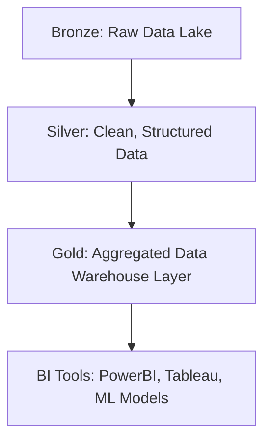

# 🎥 Separate Videos Needed on Topics  

📺 **YouTube Channel:**  
[Databricks Playlist](https://www.youtube.com/watch?v=yd51vbzA570&list=PLz-qytj7eIWWRz_1hFSleVBwZAoD1eTqU&index=2)

# 📑 Data Lakehouse Notes

## 📌 Table of Contents
- [Abbreviations](#abbreviations)
- [Infra Management](#infra-management)
- [Lakehouse Architecture](#lakehouse-architecture)
  - [Medallion Architecture](#medallion-architecture)
  - [Visualization (Mermaid Diagram)](#mermaid-diagram)
  - [Visualization (ASCII Art)](#ascii-diagram-art-version)
- [ASCII(Art Version)](#ASCII Diagram (art version))
- [Z-Order Clustering](#z-order-clustering)

---

## 📌 Topics for Separate Videos
1. **Unity Catalog**  Three level hierarchy
2. **Compute App**
3. Git -> Sparse Checkout
4. Schedule -> Compute
5. **Databricks Assistant**
6. AI/ML -> models 
7. *(Add more topics as needed)*  


# Databricks_Bizmetric
- Databricks Auto ML 
- Mosiac AI & Gen AI Using Databricks
- MLOps Concepts on Databricks

# Overall 
- ML, DL - Concepts
- MLFlow
- Unity Catalog
- Real time Model Inferencing
- Batch Inferencing
- Databricks
 - Databricks Auto ML
 - Mosiac AI - Gen AI Using Databricks
 - MLOps Concepts on Databricks
- AI/BI Dashboard along with Giene


---


# Roadmap
# 🚀 Databricks + AI Roadmap

A structured roadmap to get started with:
1. Databricks AutoML
2. Mosaic AI (Generative AI on Databricks)
3. MLOps Concepts on Databricks

---

## 1. 📈 Databricks AutoML

### 🟢 Beginner
- Understand what AutoML is and how Databricks supports it
- Explore UI and basic configurations
- Run first AutoML experiment (e.g., classification/regression)

**Topics to Cover:**
- AutoML Overview
- Databricks UI-based AutoML
- Data preparation using Delta Lake

**Resources:**
- 📘 [Databricks AutoML Overview](https://docs.databricks.com/en/machine-learning/automl/index.html)
- 🎥 [Intro to Databricks AutoML (YouTube)](https://www.youtube.com/watch?v=t5smyJmRAjU)

### 🟡 Intermediate
- Customizing AutoML experiments
- Using Notebooks generated by AutoML
- Model interpretability

**Topics to Cover:**
- Feature importance and SHAP
- Using MLflow tracking
- Model deployment

**Resources:**
- 📘 [Using AutoML in Notebooks](https://docs.databricks.com/en/machine-learning/automl/experiments.html)
- 🧪 [MLflow with AutoML](https://mlflow.org/docs/latest/index.html)

### 🔴 Advanced
- AutoML APIs (Python SDK)
- Hyperparameter tuning integration
- Integrating AutoML into pipelines

**Resources:**
- 📘 [AutoML API Docs](https://docs.databricks.com/en/api/python/workspace/mlflow.html)
- 🧱 [Databricks ML Runtime Details](https://docs.databricks.com/en/machine-learning/index.html)

---

## 2. 🤖 Mosaic AI (Generative AI with Databricks)

### 🟢 Beginner
- Understand Generative AI & LLMs
- Learn what Mosaic AI is and how it works on Databricks
- Use Mosaic AI Foundation Models in notebooks

**Topics to Cover:**
- Introduction to Mosaic AI
- Model inference using Foundation Models
- Prompt engineering basics

**Resources:**
- 📘 [Mosaic AI Overview](https://www.databricks.com/product/mosaic-ai)
- 🧱 [Foundation Model APIs](https://docs.databricks.com/en/generative-ai/foundation-models/index.html)
- 🧑‍🏫 [Prompt Engineering Guide](https://docs.databricks.com/en/generative-ai/prompt-engineering.html)

### 🟡 Intermediate
- Fine-tuning and embedding models
- Retrieval-Augmented Generation (RAG)
- Using Vector Search with Unity Catalog

**Resources:**
- 📘 [Build RAG with Databricks](https://docs.databricks.com/en/generative-ai/rag/index.html)
- 📘 [Databricks Vector Search](https://docs.databricks.com/en/generative-ai/vector-search/index.html)

### 🔴 Advanced
- Train LLMs using Mosaic AI Training
- Use custom datasets and evaluate performance
- Deploy LLM apps securely

**Resources:**
- 📘 [Mosaic AI Training Docs](https://docs.databricks.com/en/generative-ai/mosaic-ai-training/index.html)
- 🔐 [Security & Governance for GenAI](https://www.databricks.com/blog/secure-govern-genai)

---

## 3. 🔁 MLOps Concepts on Databricks

### 🟢 Beginner
- Understand MLOps lifecycle
- MLflow basics (tracking, registry)
- Deployment options (batch, real-time)

**Topics to Cover:**
- ML Lifecycle
- CI/CD concepts
- Model Registry

**Resources:**
- 📘 [Databricks MLOps Guide](https://docs.databricks.com/en/mlops/index.html)
- 📘 [MLflow Tracking](https://mlflow.org/docs/latest/tracking.html)
- 🏷️ [MLflow Model Registry](https://mlflow.org/docs/latest/model-registry.html)

### 🟡 Intermediate
- Feature Store
- Model monitoring and alerting
- Model versioning

**Resources:**
- 🧱 [Databricks Feature Store](https://docs.databricks.com/en/machine-learning/feature-store/index.html)
- 📘 [Model Monitoring](https://docs.databricks.com/en/mlops/model-monitoring.html)

### 🔴 Advanced
- CI/CD with GitHub Actions / Azure DevOps
- Orchestrating workflows with Databricks Jobs and DLT
- Governance and lineage

**Resources:**
- 🛠️ [MLOps Workflow Automation](https://docs.databricks.com/en/mlops/mlops-workflows.html)
- 🧪 [CI/CD Integration Guide](https://docs.databricks.com/en/dev-tools/ci-cd/index.html)
- 🔍 [Unity Catalog Lineage](https://docs.databricks.com/en/data-governance/unity-catalog/data-lineage.html)

---

## 🔚 Final Notes
- 🧭 Practice by building end-to-end ML pipelines using AutoML + Mosaic AI + MLOps.
- 🧪 Explore sample projects on the Databricks Community or GitHub.

**Databricks Community Resources:**
- 💬 [Databricks Community](https://community.databricks.com/)
- 🧠 [Databricks Academy Courses](https://academy.databricks.com/)

---
## Concepts
Lakehouse Architecture : Data Lake + Data Warehouse  </br>
Medallion Architecture : Bronze, Silver, Gold        </br>
Mermaid Diagram :                                    </br>
ASCII Diagram (art version):                         </br>


## Abbreviations
- **ACID** : Atomicity, Consistency, Isolation, and Durability architecture   </br>
- **GDPR** : General Data Protection Regulation                             </br>
- **HIPAA** : Health Insurance Portability and Accountability Act           </br>
- **CCPA** : California Consumer Privacy Act                                </br>
- **CDC**  : Change Data Capture                                            </br>
- **SCSS** : Sass CSS (Syntactically Awesome Style Sheets) - CSS extension language for web developers that adds features like variables, nesting, and mixins to make stylesheets more dynamic and maintainable </br>
- **S3, ADLS, GCS** : Simple Storage Service (AWS), Azure Data Lake Storage, Google Cloud Storage </br>

---

## Infra Management
Infra management refers to the **administration of compute, storage, networking, and governance** for data platforms.

### 🔧 Examples:
- Cluster provisioning & auto-scaling  
- Storage management (S3, ADLS, GCS)  
- Networking & security (IAM, VPC, encryption)  
- Performance tuning (partitioning, caching, indexing)  
- Monitoring & cost optimization  

👉 **Snowflake** → serverless, auto-managed infra.  
👉 **Databricks/Delta** → user controls infra (clusters, jobs, tuning).  

---

## Lakehouse Architecture
A **Lakehouse** combines the low-cost, flexible storage of **Data Lakes** with the governance, performance, and SQL support of **Data Warehouses**.

- **Data Lake** = Raw, cheap storage, no schema enforcement.  
- **Data Warehouse** = Structured, expensive, BI-ready.  
- **Lakehouse** = Unified platform with **ACID + open formats (Parquet, Delta, Iceberg)**.  

---

### Medallion Architecture
- **Bronze Layer** → Raw data (CSV, JSON, IoT logs, images).  
- **Silver Layer** → Cleaned, structured, de-duplicated data.  
- **Gold Layer** → Aggregated, business-ready datasets for BI/ML.  

---

### Mermaid Diagram

### ASCII Diagram (art version)
             ┌─────────────────────────┐
             │     BI Tools / ML       │
             │  (Tableau, PowerBI, AI) │
             └───────────▲─────────────┘
                         │
              ┌──────────┴───────────┐
              │   Gold Layer (DW)    │
              │ Curated, Aggregated  │
              └──────────▲───────────┘
                         │
              ┌──────────┴───────────┐
              │  Silver Layer (Ref.) │
              │ Clean, Standardized  │
              └──────────▲───────────┘
                         │
              ┌──────────┴───────────┐
              │  Bronze Layer (Raw)  │
              │ Logs, JSON, CSV, Img │
              └──────────────────────┘

### Z-order Clustering

- Problem: Queries may scan all files if data is scattered (expensive & slow).
- Solution: Z-order clustering co-locates related data in files (multi-dimensional index).

####📌 Example:

- Without Z-order: Query customer_id=123 scans 100 files.
- With Z-order on customer_id: Only 5 files scanned → 20x faster.

####🚀 Command in Databricks:
```
OPTIMIZE zomato_delta_table
ZORDER BY (Country_Code, Rating_text)
```
