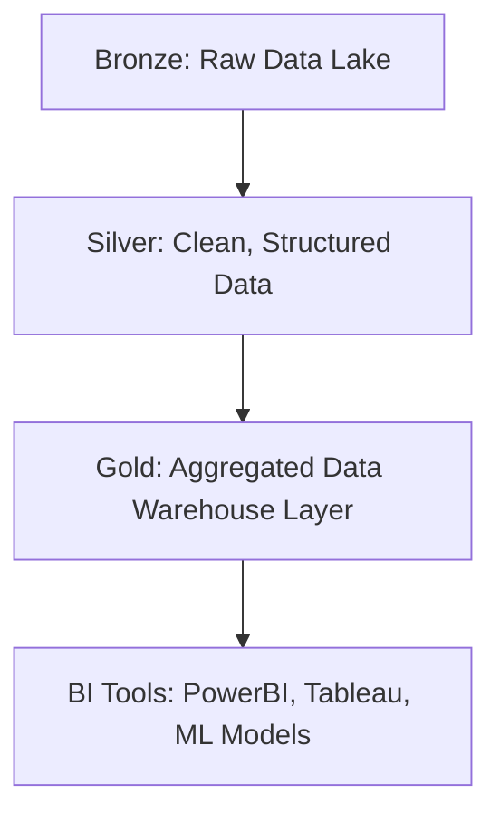

# 🎥 Separate Videos Needed on Topics  

📺 **YouTube Channel:**  
[Databricks Playlist](https://www.youtube.com/watch?v=yd51vbzA570&list=PLz-qytj7eIWWRz_1hFSleVBwZAoD1eTqU&index=2)

# 📑 Data Lakehouse Notes

## 📌 Table of Contents
- [Abbreviations](#abbreviations)
- [Definitions](#Defintions)
  - [Data Streaming and Data Blobs](#data-streaming-&-blobs)
- [Infra Management](#infra-management)
- [Lakehouse Architecture](#lakehouse-architecture)
  - [Medallion Architecture](#medallion-architecture)
  - [Visualization (Mermaid Diagram)](#mermaid-diagram)
  - [Visualization (ASCII Art)](#ascii-diagram-art-version)
- [Z-Order Clustering](#z-order-clustering)
- [Snowflake Table vs Delta Lake Tables](#difference-between-delta-tables-and-snowflake-tables)
- [PySpark vs SparkSQL](#difference-between-pySpark-and-sparkSQL)

---

## 📌 Topics for Separate Videos
1. **Unity Catalog**  Three level hierarchy
2. **Compute App**
3. Git -> Sparse Checkout
4. Schedule -> Compute
5. **Databricks Assistant**
6. AI/ML -> models 
7. *(Add more topics as needed)*  


# Databricks_Bizmetric
- Databricks Auto ML 
- Mosiac AI & Gen AI Using Databricks
- MLOps Concepts on Databricks

# Overall 
- ML, DL - Concepts
- MLFlow
- Unity Catalog
- Real time Model Inferencing
- Batch Inferencing
- Databricks
 - Databricks Auto ML
 - Mosiac AI - Gen AI Using Databricks
 - MLOps Concepts on Databricks
- AI/BI Dashboard along with Giene


---


# Roadmap
# 🚀 Databricks + AI Roadmap

A structured roadmap to get started with:
1. Databricks AutoML
2. Mosaic AI (Generative AI on Databricks)
3. MLOps Concepts on Databricks

---

## 1. 📈 Databricks AutoML

### 🟢 Beginner
- Understand what AutoML is and how Databricks supports it
- Explore UI and basic configurations
- Run first AutoML experiment (e.g., classification/regression)

**Topics to Cover:**
- AutoML Overview
- Databricks UI-based AutoML
- Data preparation using Delta Lake

**Resources:**
- 📘 [Databricks AutoML Overview](https://docs.databricks.com/en/machine-learning/automl/index.html)
- 🎥 [Intro to Databricks AutoML (YouTube)](https://www.youtube.com/watch?v=t5smyJmRAjU)

### 🟡 Intermediate
- Customizing AutoML experiments
- Using Notebooks generated by AutoML
- Model interpretability

**Topics to Cover:**
- Feature importance and SHAP
- Using MLflow tracking
- Model deployment

**Resources:**
- 📘 [Using AutoML in Notebooks](https://docs.databricks.com/en/machine-learning/automl/experiments.html)
- 🧪 [MLflow with AutoML](https://mlflow.org/docs/latest/index.html)

### 🔴 Advanced
- AutoML APIs (Python SDK)
- Hyperparameter tuning integration
- Integrating AutoML into pipelines

**Resources:**
- 📘 [AutoML API Docs](https://docs.databricks.com/en/api/python/workspace/mlflow.html)
- 🧱 [Databricks ML Runtime Details](https://docs.databricks.com/en/machine-learning/index.html)

---

## 2. 🤖 Mosaic AI (Generative AI with Databricks)

### 🟢 Beginner
- Understand Generative AI & LLMs
- Learn what Mosaic AI is and how it works on Databricks
- Use Mosaic AI Foundation Models in notebooks

**Topics to Cover:**
- Introduction to Mosaic AI
- Model inference using Foundation Models
- Prompt engineering basics

**Resources:**
- 📘 [Mosaic AI Overview](https://www.databricks.com/product/mosaic-ai)
- 🧱 [Foundation Model APIs](https://docs.databricks.com/en/generative-ai/foundation-models/index.html)
- 🧑‍🏫 [Prompt Engineering Guide](https://docs.databricks.com/en/generative-ai/prompt-engineering.html)

### 🟡 Intermediate
- Fine-tuning and embedding models
- Retrieval-Augmented Generation (RAG)
- Using Vector Search with Unity Catalog

**Resources:**
- 📘 [Build RAG with Databricks](https://docs.databricks.com/en/generative-ai/rag/index.html)
- 📘 [Databricks Vector Search](https://docs.databricks.com/en/generative-ai/vector-search/index.html)

### 🔴 Advanced
- Train LLMs using Mosaic AI Training
- Use custom datasets and evaluate performance
- Deploy LLM apps securely

**Resources:**
- 📘 [Mosaic AI Training Docs](https://docs.databricks.com/en/generative-ai/mosaic-ai-training/index.html)
- 🔐 [Security & Governance for GenAI](https://www.databricks.com/blog/secure-govern-genai)

---

## 3. 🔁 MLOps Concepts on Databricks

### 🟢 Beginner
- Understand MLOps lifecycle
- MLflow basics (tracking, registry)
- Deployment options (batch, real-time)

**Topics to Cover:**
- ML Lifecycle
- CI/CD concepts
- Model Registry

**Resources:**
- 📘 [Databricks MLOps Guide](https://docs.databricks.com/en/mlops/index.html)
- 📘 [MLflow Tracking](https://mlflow.org/docs/latest/tracking.html)
- 🏷️ [MLflow Model Registry](https://mlflow.org/docs/latest/model-registry.html)

### 🟡 Intermediate
- Feature Store
- Model monitoring and alerting
- Model versioning

**Resources:**
- 🧱 [Databricks Feature Store](https://docs.databricks.com/en/machine-learning/feature-store/index.html)
- 📘 [Model Monitoring](https://docs.databricks.com/en/mlops/model-monitoring.html)

### 🔴 Advanced
- CI/CD with GitHub Actions / Azure DevOps
- Orchestrating workflows with Databricks Jobs and DLT
- Governance and lineage

**Resources:**
- 🛠️ [MLOps Workflow Automation](https://docs.databricks.com/en/mlops/mlops-workflows.html)
- 🧪 [CI/CD Integration Guide](https://docs.databricks.com/en/dev-tools/ci-cd/index.html)
- 🔍 [Unity Catalog Lineage](https://docs.databricks.com/en/data-governance/unity-catalog/data-lineage.html)

---

## 🔚 Final Notes
- 🧭 Practice by building end-to-end ML pipelines using AutoML + Mosaic AI + MLOps.
- 🧪 Explore sample projects on the Databricks Community or GitHub.

**Databricks Community Resources:**
- 💬 [Databricks Community](https://community.databricks.com/)
- 🧠 [Databricks Academy Courses](https://academy.databricks.com/)

---
## Concepts
Lakehouse Architecture : Data Lake + Data Warehouse  </br>
Medallion Architecture : Bronze, Silver, Gold        </br>
Mermaid Diagram :                                    </br>
ASCII Diagram (art version):                         </br>


## Abbreviations
- **ACID** : Atomicity, Consistency, Isolation, and Durability architecture   </br>
- **GDPR** : General Data Protection Regulation                             </br>
- **HIPAA** : Health Insurance Portability and Accountability Act           </br>
- **CCPA** : California Consumer Privacy Act                                </br>
- **CDC**  : Change Data Capture                                            </br>
- **SCSS** : Sass CSS (Syntactically Awesome Style Sheets) - CSS extension language for web developers that adds features like variables, nesting, and mixins to make stylesheets more dynamic and maintainable </br>
- **S3, ADLS, GCS** : Simple Storage Service (AWS), Azure Data Lake Storage, Google Cloud Storage </br>
- **Unity Catalogue** : centralized data governance layer, It allows for granular security control and managing data and metadata assets in a unified system within Databricks, _In addition, it provides **access control, audits, logs** and **lineage**_ </br>
---
## Definitions
### Data Streaming & Data Blobs
- Data streaming's significance lies in enabling real-time, low-latency processing of continuously generated data, crucial for instant insights in finance, IoT, and more, while data blobs are Binary Large Objects that store unstructured binary data like images and videos in object storage, supporting both random access and some streaming scenarios like media playback but not the continuous real-time flow of data streaming.
---
## Infra Management
Infra management refers to the **administration of compute, storage, networking, and governance** for data platforms.

### 🔧 Examples:
- Cluster provisioning & auto-scaling  
- Storage management (S3, ADLS, GCS)  
- Networking & security (IAM, VPC, encryption)  
- Performance tuning (partitioning, caching, indexing)  
- Monitoring & cost optimization  

👉 **Snowflake** → serverless, auto-managed infra.  </br>
👉 **Databricks/Delta** → user controls infra (clusters, jobs, tuning).  

### Another Perspective

1️⃣ What is Infra (Infrastructure) Management?

In the context of data platforms (like Databricks, Snowflake, Hadoop clusters):
Infra management = the set of tasks needed to keep the platform running, reliable, and scalable.

#### 🔧Examples of Infra Management
 - Cluster Provisioning & Scaling
   -  Choosing VM size (CPU, RAM, GPU)
   - Auto-scaling up/down with workload

- Storage Setup
  - Choosing cloud storage (S3, ADLS, GCS)
  - Managing partitions, file formats, lifecycle policies

- Networking & Security
  - VPC, firewall rules, IAM roles, data encryption, compliance (GDPR, HIPAA)

- Performance Tuning
  - Optimizing partitions, caching, indexing, cluster utilization

- Monitoring & Maintenance
  - Cluster health, logs, costs, job retries, software patches

👉 Snowflake → handles infra management automatically (serverless, you just choose “warehouse size”).
👉 Databricks / Delta Lake → you (or admin) manage clusters, tuning, file optimization.
---

## Lakehouse Architecture
A **Lakehouse** combines the low-cost, flexible storage of **Data Lakes** with the governance, performance, and SQL support of **Data Warehouses**.

- **Data Lake** = Raw, cheap storage, no schema enforcement.  
- **Data Warehouse** = Structured, expensive, BI-ready.  
- **Lakehouse** = Unified platform with **ACID + open formats (Parquet, Delta, Iceberg)**.  

---

### Medallion Architecture
- **Bronze Layer** → Raw data (CSV, JSON, IoT logs, images).  
- **Silver Layer** → Cleaned, structured, de-duplicated data.  
- **Gold Layer** → Aggregated, business-ready datasets for BI/ML.  

---

### Mermaid Diagram

### ASCII Diagram (art version)
             ┌─────────────────────────┐
             │     BI Tools / ML       │
             │  (Tableau, PowerBI, AI) │
             └───────────▲─────────────┘
                         │
              ┌──────────┴───────────┐
              │   Gold Layer (DW)    │
              │ Curated, Aggregated  │
              └──────────▲───────────┘
                         │
              ┌──────────┴───────────┐
              │  Silver Layer (Ref.) │
              │ Clean, Standardized  │
              └──────────▲───────────┘
                         │
              ┌──────────┴───────────┐
              │  Bronze Layer (Raw)  │
              │ Logs, JSON, CSV, Img │
              └──────────────────────┘

### Z-order Clustering

- Problem: Queries may scan all files if data is scattered (expensive & slow).
- Solution: Z-order clustering co-locates related data in files (multi-dimensional index).

#### 📌Example:

- Without Z-order: Query customer_id=123 scans 100 files.
- With Z-order on customer_id: Only 5 files scanned → 20x faster.

#### 🚀Command in Databricks:
```
OPTIMIZE zomato_delta_table
ZORDER BY (Country_Code, Rating_text)
```
#### 
# Difference between Delta Tables and Snowflake Tables  

Awesome question 🙌 — comparing Delta tables (Databricks) vs Snowflake tables is like comparing two different approaches to data storage and analytics. Let’s break it down in a clean way.  

---

## 🆚 Delta Tables vs Snowflake Tables  

| Aspect | Delta Tables (Databricks / Delta Lake) | Snowflake Tables (Snowflake DB) |
|--------|-----------------------------------------|---------------------------------|
| **Underlying Tech** | Built on Apache Parquet + transaction log (`_delta_log`). | Proprietary cloud-native database, stores data in optimized micro-partitions. |
| **Where it Lives** | Stored in your cloud storage (S3, ADLS, GCS) with Delta format. | Stored inside Snowflake-managed storage (you don’t see raw files). |
| **Format** | Open-source format (Delta Lake). Files can be read by Spark, Pandas, Presto, etc. | Proprietary format, only accessible through Snowflake. |
| **ACID Transactions** | ✅ Supported (thanks to `_delta_log`). | ✅ Supported natively. |
| **Schema Evolution** | ✅ Supported (can add/drop columns, merge schemas). | ✅ Supported (`ALTER TABLE`). |
| **Performance Optimizations** | - Data skipping <br> - **Z-order clustering** <br> - Caching in Databricks | - Automatic clustering <br> - Micro-partition pruning <br> - Query result caching |
| **Compute & Storage** | Decoupled: you choose compute (Databricks clusters, Spark, etc.) separate from cloud storage. | Decoupled: compute (virtual warehouses) and storage are fully managed by Snowflake. |
| **Scaling** | Scales with Spark cluster size. | Scales elastically with virtual warehouses (auto-suspend / auto-resume). |
| **Data Sharing** | Share by exposing storage (Parquet/Delta files) or Databricks Delta Sharing. | Native **Snowflake Secure Data Sharing** (no data movement, metadata-based). |
| **Openness** | Open-source (Delta Lake) → can be read outside Databricks. | Proprietary → locked inside Snowflake. |
| **Best For** | - Lakehouse architecture (data lakes + warehouses). <br> - Large-scale ETL/ELT on raw/semi-structured data. <br> - When you want open format + flexibility. | - Cloud data warehouse use cases. <br> - BI/reporting with SQL. <br> - When you want fully managed simplicity with zero infra ops. |

---

## ⚡ Key Differences in Philosophy  

- **Delta Tables (Databricks)** → An open **Lakehouse** format sitting on top of your cloud storage, great for data engineers and ML/AI workloads.  
- **Snowflake Tables** → A closed **data warehouse** system, great for business intelligence and SQL analytics.  

---

## ✅ Example Use Cases  

- **Use Delta if:** you want an open format, heavy Spark ML pipelines, streaming + batch unification, or to avoid vendor lock-in.  
- **Use Snowflake if:** your org is SQL-heavy, BI-focused, and you want zero infra management.  

---
# Difference between PySpark and SparkSQL

## 🆚 PySpark vs Spark SQL

PySpark and Spark SQL are both integral components of **Apache Spark**, a distributed computing framework for big data processing, but they serve different purposes and offer different approaches to data manipulation.

---

### 🔹 PySpark
**PySpark** is the Python API for Apache Spark. It allows users to interact with Spark's functionalities, including its distributed computing capabilities, using Python.  

PySpark provides a rich set of APIs for working with Resilient Distributed Datasets (RDDs), DataFrames, and Datasets. It is commonly used for:

- **General-purpose data processing**: Performing complex transformations, aggregations, and analyses on large datasets.  
- **Machine learning**: Utilizing Spark MLlib for various machine learning tasks.  
- **Graph processing**: Leveraging GraphX for graph-parallel computation.  
- **Stream processing**: Building real-time data processing pipelines with Spark Streaming.  

---

## 🔹 Spark SQL
**Spark SQL** is a Spark module specifically designed for **structured data processing**. It enables users to interact with Spark using SQL-like queries and provides a DataFrame API for programmatic manipulation of structured data.  

Spark SQL is particularly useful for:

- **SQL-savvy users**: Allowing data analysts and engineers familiar with SQL to query and manipulate data in Spark.  
- **Integrating with existing SQL infrastructure**: Connecting to external data sources like Hive and executing HiveQL queries.  
- **Schema inference and data sources**: Automatically inferring schemas from various data sources and providing a unified way to access them.  

---

## 🔑 Key Differences

The core difference lies in their approach to data interaction:

### 1. Language/Interface  
- **PySpark** → Primarily utilizes Python code and its DataFrame API for data manipulation, offering a programmatic and object-oriented approach.  
- **Spark SQL** → Focuses on SQL syntax for querying and manipulating data, providing a declarative approach.  

### 2. Target Audience  
- **PySpark** → Preferred by data engineers and developers who are comfortable with Python and require fine-grained control over data transformations and integrations with other Python libraries.  
- **Spark SQL** → Often favored by data analysts and others who are more proficient in SQL and need to perform ad-hoc queries and analysis on structured data.  

### 3. Flexibility and Control  
- **PySpark** → Offers greater flexibility and control over complex data transformations and custom logic due to its programmatic nature.  
- **Spark SQL** → More constrained by the limitations of SQL syntax but excels in readability and ease of use for standard SQL operations.  

---

## 📝 Summary
In essence:  

- **PySpark** provides the comprehensive Python interface to Spark's entire ecosystem.  
- **Spark SQL** is a specialized module within Spark that brings the power of SQL to big data processing.  

👉 They can be used **independently or in conjunction**, depending on the specific task and the user’s skillset.  
